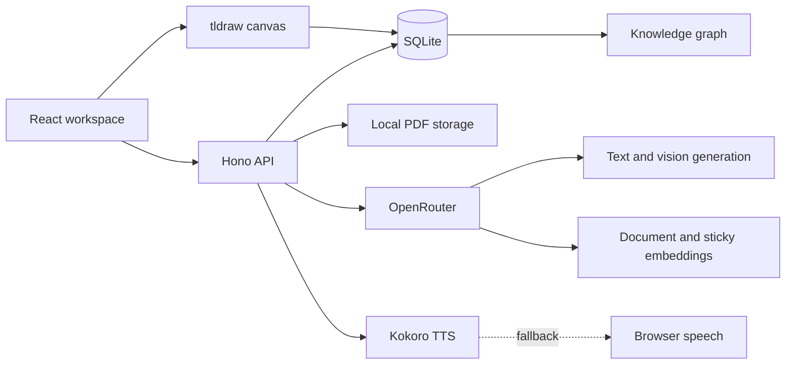

<p align="center">
  
</p>

<h1 align="center">ScholarLM</h1>

<p align="center">
  An AI-assisted learning workspace for reading, annotating, searching, and
  connecting knowledge across PDFs and infinite canvases.
</p>

ScholarLM combines page-aware PDF retrieval, handwritten and typed canvas
notes, visual explanations, deterministic equation graphing, speech, semantic
search, and a connected knowledge graph in one local-first workspace.

## Highlights

- **PDF workspace:** Render a PDF inside a persistent tldraw canvas while
  keeping explanations, Ask PDF, search, notes, and graph tools in an organized
  inspector.
- **Infinite canvas:** Create standalone canvases without uploading a PDF, then
  attach a document later without losing the drawing.
- **Explain selections:** Explain selectable PDF text, typed canvas text,
  lassoed handwriting, or a pasted/uploaded screenshot.
- **Ask PDF:** Ask page-aware questions and receive grounded answers with
  clickable source pages. Questions and answers persist while navigating.
- **Math Notes-style graphing:** Inspect and correct the recognized equation,
  then deterministically plot supported functions such as `y = sin(x)`,
  `y = x²`, `y = 1/x`, and circles such as `x² + y² = 1`.
- **Sticky knowledge:** Save an answer or explanation as a movable,
  theme-aware sticky note and index it alongside the PDF.
- **Semantic retrieval:** Search PDF passages and indexed stickies together
  using hosted embeddings stored in the local database.
- **Knowledge atlas:** Explore PDFs, linked canvases, sticky notes,
  handwriting, and extracted concepts as connected, searchable nodes.
- **Speech:** Generate local Kokoro speech when available and fall back to the
  browser speech engine when it is not.
- **Reliable persistence:** Store tldraw snapshots in SQLite, retain browser
  recovery drafts, cache unchanged explanations, and prune explanations whose
  unsaved source ink was deleted.
- **Safe deletion:** Documents, canvases, notes, and graph nodes require
  confirmation and remove their affiliated indexes, explanations, edges,
  files, and browser recovery copies.

## Product visual

<p align="center">
  
</p>

The orange ScholarLM hub represents the central knowledge library. PDFs,
canvases, handwriting, explanations, and sticky notes form the connected
learning graph around it.

## Architecture



### Frontend

- React, React Router, TanStack Query, and Framer Motion
- tldraw for standalone and PDF-linked infinite canvases
- Sigma.js, Graphology, and ForceAtlas2 for the knowledge atlas
- `react-pdf` and PDF.js for document rendering and text selection

### Backend

- Bun and Hono
- SQLite for documents, pages, chunks, embeddings, canvases, explanations,
  speech metadata, sticky indexes, and graph data
- OpenRouter for generation, visual recognition, and embeddings
- A restricted deterministic math parser and sampler for verified 2D plots
- Compact Kokoro ONNX speech generation

## Requirements

- [Bun](https://bun.sh/) 1.3 or newer
- An [OpenRouter](https://openrouter.ai/) API key
- A modern Chromium, Firefox, or Safari browser

## Setup

1. Clone the repository and enter it:

   ```sh
   git clone https://github.com/Mikeyzgoat/ScholarLM.git
   cd ScholarLM
   ```

2. Create the environment file:

   ```sh
   cp .env.example .env
   ```

3. Add the OpenRouter key to `.env`:

   ```env
   OPENROUTER_API_KEY=your_key_here
   ```

4. Install both applications:

   ```sh
   cd backend
   bun install
   cd ../frontend
   bun install
   ```

5. Start the backend:

   ```sh
   cd backend
   bun run dev
   ```

6. In another terminal, start the frontend:

   ```sh
   cd frontend
   bun run dev
   ```

Open [http://localhost:3000](http://localhost:3000). The API defaults to
`http://localhost:3001`.

## Configuration

The checked-in `.env.example` documents all supported variables:

```env
BACKEND_PORT=3001
FRONTEND_ORIGIN=http://localhost:3000
OPENROUTER_API_KEY=
OPENROUTER_BASE_URL=https://openrouter.ai/api/v1
OPENROUTER_MODEL=openrouter/free
OPENROUTER_EMBEDDING_MODEL=nvidia/nemotron-3-embed-1b:free
OPENROUTER_MAX_INPUT_PRICE=0.2
OPENROUTER_MAX_OUTPUT_PRICE=0.4
```

The default generation route is economical but may occasionally be
unavailable. ScholarLM retries transient provider failures and preserves the
active selection for a manual retry.

## Core workflows

### Read and annotate a PDF

1. Upload a PDF from Documents.
2. Open it immediately while extraction and indexing continue in the
   background.
3. Use **Draw** for ink and **Select Text** for the PDF text layer.
4. Explain the selection, ask a grounded question, or save the response as a
   sticky.
5. Search the PDF and saved stickies together or inspect their graph
   connections.

### Explain handwriting or a screenshot

1. Select a handwritten canvas region, or switch the explanation input to
   **Upload screenshot**.
2. Paste with `Ctrl/Cmd+V` or choose PNG, JPEG, or WebP input.
3. Review the explanation and recognized equation.
4. Save it as text/sticky or insert a verified graph.

Unchanged canvas selections reuse their stored explanation. If source ink is
deleted, its unsaved explanation is removed during canvas persistence; an
explanation explicitly saved as a canvas object is retained.

### Draw a verified equation graph

ScholarLM separates recognition from plotting:

```text
Selected text or ink
        ↓
Recognized equation shown for correction
        ↓
Restricted deterministic parser
        ↓
Finite-domain sampling and discontinuity splitting
        ↓
Source-linked graph on the canvas
```

The initial deterministic scope includes arithmetic operators, parentheses,
powers, roots, common trigonometric functions, explicit `y = f(x)` relations,
and origin-centered circles. Unsupported equations produce a clear message
instead of invented plot points.

## Routes

| Route | Purpose |
| --- | --- |
| `/` | Product home and demo landing page |
| `/upload` | Upload and manage PDF documents |
| `/workspace/:documentId` | PDF canvas and research inspector |
| `/notes` | Standalone and document-linked canvas library |
| `/notes/:noteId` | Full document-linked canvas |
| `/canvas/:canvasId` | Standalone infinite canvas |
| `/graph` | Global knowledge atlas |
| `/graph/:documentId` | Document-specific knowledge graph |

## Local data and privacy

ScholarLM stores application data locally:

- Database: `backend/data/scholarlm.sqlite`
- Uploaded PDFs: `backend/data/uploads/`
- Standalone canvas recovery: browser localStorage under
  `scholarlm-local-canvas:*`
- Linked-note recovery: browser localStorage under
  `scholarlm-note-draft:*`
- Per-document inspector state: browser sessionStorage

These runtime files and secrets are excluded from Git. Selected content,
screenshots, generation prompts, and embedding input are sent to the configured
OpenRouter service. Kokoro speech remains local when its model is available.

## Verification

Run strict TypeScript checks:

```sh
cd backend
bun run typecheck

cd ../frontend
bun run typecheck
```

Build the frontend:

```sh
cd frontend
bun run build
```

With the backend running:

```sh
curl http://localhost:3001/health
```

The health response includes `ok: true` and provider status information.

## Deployment notes

GitHub Pages cannot host the complete application because ScholarLM requires a
Bun API, writable SQLite storage, uploaded PDF storage, and local speech model
files. A static frontend can be deployed separately, but a complete hosted
deployment requires:

- a persistent Bun-compatible backend;
- durable storage for SQLite and uploads;
- frontend and API environment/origin configuration.

For the current project and demo, local execution is the most complete and
reliable deployment mode.

## Current limitations

- Handwriting recognition accuracy depends on the configured visual model.
- Automatic math-region detection without selecting ink is still a future
  enhancement.
- The deterministic graph engine intentionally rejects unsupported expressions
  rather than executing arbitrary code.
- Kokoro initialization can be resource-intensive; browser speech is used as a
  fallback.
- Authentication and hosted multi-user storage are intentionally deferred.

See [future_upgrades.md](future_upgrades.md) for the engineering roadmap and
extended acceptance criteria.

## Demo and report

For a short project demonstration, show this sequence:

1. Upload and immediately open a PDF.
2. Select text and request an explanation.
3. Ask a grounded question and open its cited page.
4. Draw or paste a handwritten equation and insert its verified graph.
5. Save an explanation as a sticky and locate it through search.
6. Open the knowledge atlas and jump back to the exact canvas item.
7. Reload to demonstrate persistence.

The same sequence provides a useful experimental narrative for an IEEE-format
report: problem statement, architecture, retrieval pipeline, interaction
design, deterministic math verification, persistence model, evaluation, and
limitations.

## License

See [LICENSE](LICENSE).
