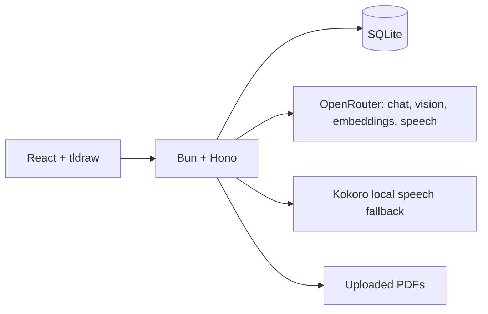

<p align="center">
  
</p>

<h1 align="center">ScholarLM</h1>

ScholarLM is a PDF study workspace built around an infinite canvas. You can
read a document, draw beside it, ask questions, explain selected text or
handwriting, and keep the useful results as notes.

The project started as a way to avoid switching between a PDF reader, a notes
app, and an AI chat window. The PDF stays in one place while the canvas remains
open for working things out.

## What it can do

- Open a PDF inside a persistent tldraw canvas
- Draw, type, highlight, and add movable sticky notes
- Explain selected PDF text or canvas content
- Queue multiple explanations without overlapping their generated audio
- Paste or upload a screenshot when text selection is unavailable
- Answer questions using the open PDF and link back to the source page
- Group related PDFs into one combined workspace and ask across the group
- Search PDF passages and saved sticky notes together
- Plot supported handwritten or typed equations
- Connect PDFs, canvases, stickies, and handwriting in a knowledge graph
- Read explanations and retrieved answers aloud with Fish Audio, Kokoro, or
  browser speech
- Create an empty canvas first and attach a PDF later

Canvas state is saved in SQLite and backed up in browser storage. Questions,
searches, and inspector tabs also survive normal navigation within a document.
Repeated selections reuse stored explanations and audio when their document,
page, canvas, shape, and content fingerprints still match. Retrieved answers
and their narration are cached too. Uploads are deduplicated by file content.

## How it is put together



The frontend handles PDF viewing, canvas editing, document groups, and the
knowledge graph. The backend stores documents and canvas snapshots, extracts
page-aware text, runs retrieval, and calls OpenRouter for generation,
embeddings, vision, and Fish Audio speech. Kokoro runs locally as the server
fallback, with browser speech as the final fallback.

## Running it locally

### Docker package (recommended)

Install Docker Desktop or Docker Engine with Compose v2, clone the repository,
and run the installer. Bun does not need to be installed on the host. The
installer prompts for the OpenRouter API key without showing it on screen,
writes an ignored `.env.docker` file, installs the locked backend and frontend
packages inside their Bun build images, builds both containers, initializes the
database on first boot, and starts ScholarLM.

Linux, macOS, WSL, or Git Bash:

```sh
./scripts/install.sh
```

Windows PowerShell:

```powershell
.\scripts\install.ps1
```

Open [http://localhost:3000](http://localhost:3000), or the custom port entered
during initialization. SQLite, uploaded PDFs, and the Kokoro model cache are
kept in Docker volumes, so recreating the containers does not erase study data.
Enter `0` when the installer asks for a frontend port to let Docker choose an
available host port automatically. The installer prints the assigned URL. You
can retrieve it later with:

```sh
docker compose --env-file .env.docker port frontend 80
```

Useful package commands:

```sh
docker compose --env-file .env.docker logs -f
docker compose --env-file .env.docker stop
docker compose --env-file .env.docker up -d
docker compose --env-file .env.docker down
```

The Docker frontend is served by Nginx at `http://localhost:3000` (or the
configured `SCHOLARLM_FRONTEND_PORT`). Nginx is not involved when running the
frontend directly with `bun run dev`. To expose the Docker entry point publicly with
ngrok's free tier, add your ngrok account token to `.env.docker`:

```env
NGROK_AUTHTOKEN=your_ngrok_authtoken
```

Then start the optional tunnel profile:

```sh
docker compose --profile tunnel --env-file .env.docker up -d ngrok
```

Open `http://localhost:4040` to copy the assigned HTTPS forwarding URL, or run:

```sh
curl -s http://localhost:4040/api/tunnels
```

The tunnel targets `http://frontend:80` inside the Compose network, so browser
routes and `/api/*` requests both continue through the existing Nginx config.
The free assigned URL can change whenever the ngrok container is recreated.

Run the initializer again to change the API key, port, or rebuild after an
update. Do not use `docker compose down -v` unless you intentionally want to
delete the database, uploaded PDFs, and cached local model files.

### Manual Bun setup

You need:

- [Bun](https://bun.sh/) 1.3 or newer
- An [OpenRouter](https://openrouter.ai/) API key
- A modern browser

Clone the repository:

```sh
git clone https://github.com/Mikeyzgoat/ScholarLM.git
cd ScholarLM
```

Create the environment file:

```sh
cp .env.example .env
```

Add your key to `.env`:

```env
OPENROUTER_API_KEY=your_key_here
```

Install the backend and frontend dependencies:

```sh
cd backend
bun install

cd ../frontend
bun install
```

Run the backend:

```sh
cd backend
bun run dev
```

Run the frontend in another terminal:

```sh
cd frontend
bun run dev
```

Open [http://localhost:3000](http://localhost:3000). The API runs on
`http://localhost:3001` by default.

## Main workflow

1. Upload a PDF (up to 50 MB) from the Documents page.
2. Open it while indexing continues in the background.
3. Use **Draw** to annotate or **Select Text** to use the PDF text layer.
4. Explain a selection, ask a question, or search for a concept.
5. Save useful output as canvas text or a sticky note.
6. Open the knowledge graph to follow connections back to their source.

The first indexing pass extracts searchable PDF text and batches its
embeddings. Visual enrichment then runs separately, so a document can become
usable before all page-image analysis is complete. Failed ingestion jobs can
be retried from the document library.

Groups created in the global knowledge graph can combine two or more PDFs into
a single paginated workspace. Group questions retrieve across every member
document and keep source links pointed at the original PDF and page.

An independent canvas can be created from Notes without uploading a document.
Its drawings are saved in both the browser and SQLite.

Explanation requests remain attached to the selection captured when they were
submitted, even if the user continues editing or changes the active selection.
Pending, completed, and failed states are persisted. The queue serializes
generation and playback, prepares both the full narration and a transition
variant, and replays stored database audio. Failed entries retain the provider
error for diagnosis. Missing narration is regenerated with the configured
speech provider or Kokoro fallback. Model-produced intent labels are normalized
to `theory`, `math`, `problem-solving`, or `general`; an unexpected label falls
back to `general` instead of discarding an otherwise valid explanation.

## Equation graphs

Graphing uses two separate steps. The visual model reads the selected equation,
then ScholarLM displays that transcription so it can be corrected. A restricted
math parser produces the graph points instead of asking the model to invent
them.

The current graphing scope includes:

- `y = f(x)` expressions such as `y = sin(x)` and `y = x²`
- powers, roots, parentheses, and common trigonometric functions
- discontinuous functions such as `y = 1/x`
- circles such as `x² + y² = 1`

Unsupported expressions are rejected instead of being evaluated as arbitrary
code. Graphs remain linked to the selected source shapes and are invalidated
when the source equation changes.

## Project structure

```text
ScholarLM/
├── backend/                 Bun, Hono, SQLite, retrieval and AI services
├── frontend/                React, tldraw, PDF.js and Sigma.js
├── docker-compose.yml       App containers and optional ngrok tunnel
├── scripts/                 Docker initialization helpers
├── future_upgrades.md       Engineering notes and remaining work
├── .env.example             Runtime configuration
└── README.md
```

Local runtime data is kept in:

```text
backend/data/scholarlm.sqlite
backend/data/uploads/
```

These files, along with `.env`, are ignored by Git.

## Configuration

The defaults in `.env.example` work for local development after adding
`OPENROUTER_API_KEY`. You can separately choose chat, vision, embedding, and
speech models with `OPENROUTER_MODEL`, `OPENROUTER_VISION_MODEL`,
`OPENROUTER_EMBEDDING_MODEL`, and `OPENROUTER_SPEECH_MODEL`.

`OPENROUTER_ROUTING_MODELS` is an ordered comma-separated fallback list.
`OPENROUTER_MAX_INPUT_PRICE` and `OPENROUTER_MAX_OUTPUT_PRICE` cap which routed
models may be used. `BACKEND_PORT` and `FRONTEND_ORIGIN` control the manual Bun
servers; Docker additionally uses `SCHOLARLM_FRONTEND_PORT`.

## Checks

Type-check both applications:

```sh
cd backend
bun run typecheck

cd ../frontend
bun run typecheck
```

Run backend regression tests:

```sh
cd backend
bun test
```

Build the frontend:

```sh
cd frontend
bun run build
```

Check the running backend:

```sh
curl http://localhost:3001/health
```

For the Docker package, rebuild and verify the Nginx-routed application:

```sh
docker compose up -d --build
curl http://localhost:3000/api/health
curl -I http://localhost:3000/notes
```

## Notes

- Selected text, screenshots, and embedding input are sent to the configured
  OpenRouter service.
- Fish Audio is the primary speech provider. Kokoro runs locally as a fallback
  and can take time to load; browser speech is used if both are unavailable.
- The free OpenRouter route can occasionally be unavailable. ScholarLM retries
  short provider failures and keeps the active selection available.
- Handwriting recognition still depends on how clearly the equation is
  written.
- Authentication and hosted multi-user storage are not part of the current
  build.

The full roadmap is in [future_upgrades.md](future_upgrades.md).

## Hosting

The complete app cannot run on GitHub Pages because it needs a writable
backend, SQLite, and PDF storage. The frontend can be hosted separately, but
the API needs a Bun-compatible host with persistent storage.

For the current demo, running it locally is the simplest option.

## License

See [LICENSE](LICENSE).
